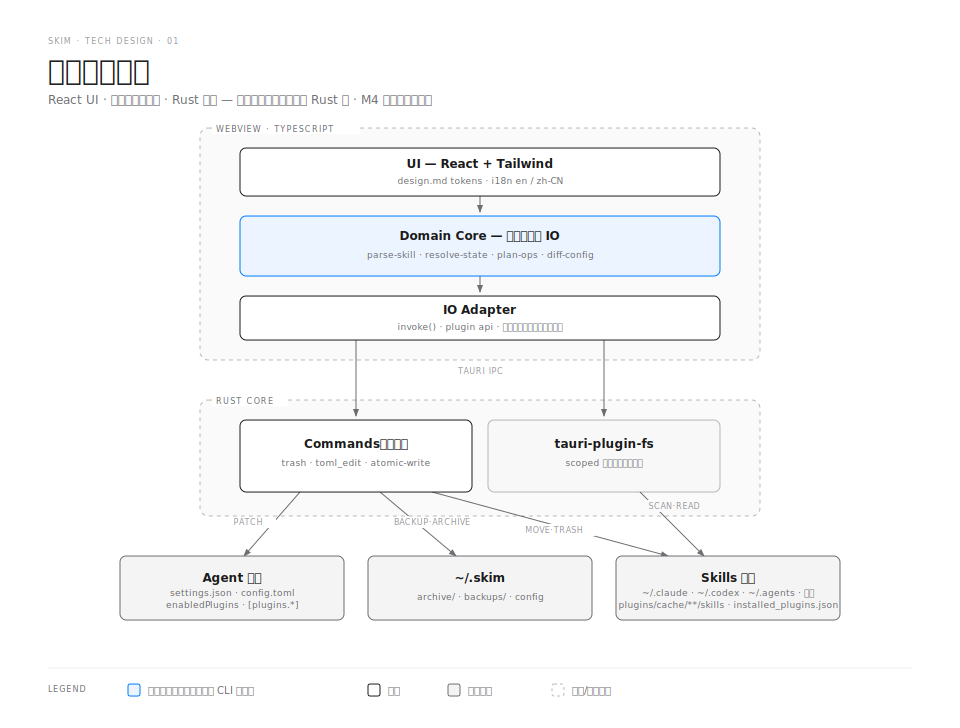
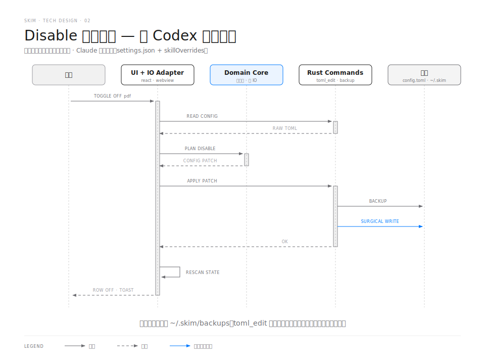
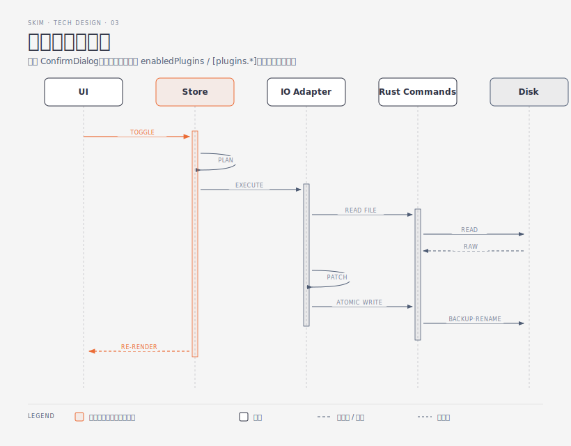

# Skim 技术方案

> 阶段：Scrum Phase 5 ｜ 日期：2026-06-15 ｜ 状态：待评审
> 上游：[user-stories.md](./user-stories.md) · [prd.md](./prd.md) · [design.md](./design.md) · 原型 `prototypes/d-codex-native.html`
> 模板来源：scrum/references/tech_design.md（按桌面应用适配：无数据库与 HTTP 接口，对应章节替换为"文件/配置数据模型"与"领域层 API / Tauri Commands"）

# 需求概述

Claude Code / Codex 用户的本地 skills 无官方管理界面。Skim 是一个 Tauri 桌面应用，提供跨 agent 的技能盘点、禁用（走 agent 原生配置）、归档（中央留底）、删除（系统废纸篓）能力。

**技术目标**（承接 PRD G1–G4）：

1. 首屏 ≤3s 呈现全部用户级技能；200 技能全量扫描 <1s
2. 所有写操作可逆且原子：写前备份、原子替换、永不 `rm -rf`
3. 配置写入保留用户既有内容与注释（外科手术式修改）
4. 领域逻辑纯函数化、零 IO，单测覆盖 >85%，未来可直接复用到 CLI

## 术语

| 术语 | 解释 |
|---|---|
| **原生禁用机制** | Claude：`settings.json` 的 `skillOverrides`（`on`/`name-only`/`user-invocable-only`/`off` 四档）；Codex：`config.toml` 的 `[[skills.config]]`（`path` + `enabled`）。disable 仅写配置，不动技能文件 |
| **四档状态** | Claude 技能的可见度档位，详见 design.md §4.5 的固定解释文案 |
| **外科手术式写入** | 只增改 Skim 管理的配置键，文件其余内容、键序、注释原样保留 |
| **操作计划（OpPlan）** | 领域层产出的纯数据结构，描述"要做什么"（如 ConfigPatch、ArchiveMove），由 IO 层执行——计划与执行分离是可测试性的关键 |
| **Stray file** | 技能目录下不构成技能的游离文件（无 SKILL.md 包裹），如 `~/.codex/skills/rams.md` |
| **插件技能** | 由 Claude Code 或 Codex 插件的 `installPath/skills/` 目录扫描而来的技能。只读展示，开关在插件级（`enabledPlugins`），不可单独归档/删除 |
| **插件级开关** | Claude：`settings.json` 的 `enabledPlugins` 键（`false` 关闭整个插件，删除键视为开启）；Codex：`config.toml` 的 `[plugins."key"]` 段的 `enabled`。关闭后影响该插件的全部能力（技能 + MCP 工具 + Hooks） |

## 用例图

用例简单且已在 PRD §5 详述，按 diagram-design 的"表格优先"原则用表代替图：

| 用例 | 触发者 | 读/写 | 落点 |
|---|---|---|---|
| 扫描/盘点、查看详情 | 启动 / 定时 / 手动刷新 | 读 | skills 目录 + agent 配置 + 会话记录 + 插件安装注册表 |
| disable / enable / 切档 | 用户 | 写 | agent 配置文件 |
| 归档 / 恢复 | 用户 | 写 | 技能目录 ↔ `~/.skim/archive/` |
| 删除 | 用户 | 写 | 技能目录 → 系统废纸篓 |
| 项目添加/移除 | 用户 | 写 | `~/.skim/config.json` |
| 插件级启用/禁用 | 用户 | 写 | `settings.json enabledPlugins` / `config.toml [plugins.*]` |

# 总体架构



## 技术选型

| 层 | 选型 | 理由 / 替代方案 |
|---|---|---|
| 应用壳 | **Tauri 2.x** | 已决策（PRD §2）。包体 5–10MB，capabilities 显式声明路径权限 |
| 前端 | **React 18 + TypeScript + Vite** | 生态最稳、招手即来的组件与测试设施；UI 复杂度低，框架差异不构成瓶颈，选熟悉度最高的。替代 Svelte（更轻但生态弱）被否 |
| 样式 | **Tailwind CSS v4** | design.md tokens 直接映射为 `@theme` 变量；原型已是 Tailwind |
| 状态 | **Zustand** | 单 store + 订阅即可，Redux 过重 |
| i18n | **i18next**（en 默认 + zh-CN） | PRD 决策 2 |
| Markdown 渲染 | **marked + DOMPurify** | SKILL.md 是不可信输入，必须消毒后渲染 |
| Rust 侧 | **toml_edit · trash · serde_json · tempfile** + 官方插件 fs / dialog / opener | toml_edit 是"保注释写 TOML"的唯一成熟方案，是配置写入放 Rust 侧的决定性理由；trash 跨平台进废纸篓；opener 实现 Reveal in Finder |
| 测试 | **Vitest + Testing Library**（TS）/ **cargo test**（Rust）/ Playwright（v1.x 再上） | 见"测试策略" |

## 分层职责（对应架构图）

1. **UI（React）**：渲染与交互，遵循 design.md；不直接碰文件系统
2. **Domain Core（纯函数，`src/domain/`）**：
   - `parse-skill`：SKILL.md frontmatter 解析、stray file 判定、重复检测
   - `resolve-state`：合并目录扫描结果 + 两家配置 → 每个技能的最终状态（含 Claude 三层 settings 优先级合并）
   - `plan-ops`：输入当前状态 + 用户意图 → 产出 OpPlan（纯数据）
   - `diff-config`：输入原始配置文本 + OpPlan → 产出 ConfigPatch（对 Claude 是 JSON 键路径操作；对 Codex 是 TOML 条目操作）
   - **铁律**：本目录禁止 import 任何 IO（无 fs、无 invoke、无 Date.now 之外的环境依赖），违者 lint 报错（eslint no-restricted-imports）
3. **IO Adapter（`src/io/`）**：把 OpPlan 翻译成 plugin-fs 调用与 Rust command invoke；唯一允许产生副作用的 TS 层
4. **Rust Commands（薄层）**：所有**破坏性能力**收敛于此——配置写入（toml_edit / serde_json + 原子替换）、备份、目录移动（归档）、废纸篓。WebView 即使被注入也无法绕过 capabilities 调用未声明的路径

## 关键时序



Claude 技能 disable 同构，差异仅在：目标文件是 `settings.json`（用户级）或 `.claude/settings.local.json`（项目级），patch 操作是 JSON 键写入。归档/删除时序为该图的变体：APPLY PATCH 步骤替换为 MOVE_DIR / TRASH_DIR，且操作后**连带清除该技能的禁用配置项**（PRD F4/F5）。

**插件级开关时序**（M4 新增）与上图的关键差异：



1. `planTogglePlugin` 产出 `ClaudePluginToggleOp` / `CodexPluginToggleOp`（而非 ConfigPatch）
2. **跳过 ConfirmDialog**——操作完全可逆，无文件删除风险
3. `applyClaudePluginEnabled` 修改 `enabledPlugins` 键（`enabled=true` 删键，`false` 置值），而非 `skillOverrides`
4. Codex 路径调用 `apply_codex_plugin_patch`，toml_edit 修改 `[plugins."key"]` 块

# 数据模型

无数据库，文件即存储。三类数据：**只读解析的外部数据**（skills 目录、agent 配置、会话记录）、**Skim 自有数据**（`~/.skim/`）、**运行时模型**（TS 类型）。

## 运行时模型（领域层核心类型）

```ts
type AgentKind = 'claude' | 'codex';
type Scope =
  | { kind: 'user'; root: string }                    // ~/.claude/skills 等
  | { kind: 'project'; root: string; project: string }
  | { kind: 'bundled'; root: string }                 // ~/.codex/skills/.system
  | { kind: 'plugin';                                 // 插件技能（只读展示）
      root: string;
      pluginKey: string;                              // "name@marketplace"
      version: string;
      pluginEnabled: boolean;
      installScope: 'user' | 'project';
      projectPath?: string;                           // installScope === 'project' 时有值
    };

type SkillStatus = 'on' | 'name-only' | 'user-invocable-only' | 'off';
// Codex 仅 'on' | 'off'（enabled），外加正交布尔 allowImplicitInvocation

interface SkillFlags {
  duplicate: boolean;
  conflict: boolean;
  strayFile: boolean;
  parseError: boolean;
  locked: boolean;        // 归档/删除被锁（bundled 与 plugin 技能）
  statusLocked: boolean;  // 单行状态切换被锁（plugin 技能；开关在插件级）
}

interface SkillRecord {
  id: string;                  // hash(agent + absPath)
  agent: AgentKind;
  scope: Scope;
  dirPath: string;             // 技能目录绝对路径
  name: string;                // frontmatter name ?? 目录名
  description: string | null;
  status: SkillStatus;
  statusSource: string | null; // 状态来自哪个配置文件（展示与回写都用它）
  sizeBytes: number;
  fileCount: number;
  flags: SkillFlags;
}

// 操作步骤 — 插件级开关新增两种
interface ClaudePluginToggleOp {
  kind: 'claude-plugin-toggle';
  settingsPath: string;        // ~/.claude/settings.json
  pluginKey: string;           // "name@marketplace"
  enabled: boolean;
}

interface CodexPluginToggleOp {
  kind: 'codex-plugin-toggle';
  configPath: string;          // ~/.codex/config.toml
  pluginKey: string;
  enabled: boolean;
}

// OpStep 联合（新增两种）
type OpStep = ClaudePatchOp | CodexPatchOp | MoveDirOp | TrashOp | RestoreOp
            | ClaudePluginToggleOp | CodexPluginToggleOp;

interface ProjectSource {
  path: string;
  origin: 'auto-claude' | 'auto-codex' | 'manual';
  skillCount: number;          // 校验存在性后统计
}
```

## `~/.skim/` 目录设计

```
~/.skim/
├── config.json          # Skim 自身设置
├── archive/
│   └── <agent>/<src-path-hash>/<skill-name>/   # 原样目录（PRD 决策 4：不压缩）
│       └── …
│   └── <agent>/<src-path-hash>/<skill-name>.manifest.json
└── backups/
    └── <配置文件名>.<ISO时间戳>.bak             # 每次配置写入前；每目标保留最近 10 份
```

**archive manifest schema**（归档/恢复的唯一依据）：

```json
{
  "version": 1,
  "skillName": "draw",
  "agent": "claude",
  "scope": "user",
  "sourcePath": "/Users/nazha/.claude/skills/draw",
  "archivedAt": "2026-06-12T08:00:00Z",
  "statusBeforeArchive": "on",
  "sizeBytes": 1234567
}
```

**config.json schema**：`{ "version": 1, "manualProjects": [...], "removedAutoProjects": [...], "refresh": { "auto": true, "intervalSec": 30 }, "advancedMode": false, "locale": "auto" }`

## 外部数据（只读解析）

| 来源 | 解析方式 |
|---|---|
| `~/.claude/skills`、`~/.codex/skills`、`~/.agents/skills`、项目级目录 | 一层目录扫描，读各 `SKILL.md` 头部（仅前 4KB，frontmatter 足够） |
| `~/.claude/settings.json` + 项目 `settings.json` / `settings.local.json` | JSON 解析，`skillOverrides` 三层合并（local > project > user）；另读 `enabledPlugins` 用于插件开关状态 |
| `~/.codex/config.toml` | TOML 解析 `[[skills.config]]`（path 归一化）；另读 `[plugins."key@marketplace"]` 块的 `enabled`/`install_path`/`version` |
| `~/.claude/projects/<编码目录名>`、`~/.codex/session_index.jsonl` | 解码出项目路径 → 存在性校验 → 探测技能目录 |
| `~/.claude/plugins/installed_plugins.json` | 插件安装注册表；格式 `{ version: 2, plugins: { "key@marketplace": [{ installPath, version, scope, projectPath? }] } }`；每个插件键可有多条安装（user / project 各一） |
| `<installPath>/skills/` | 插件技能目录；由 `installed_plugins.json` 的 `installPath` 解析而来；一层目录扫描，同标准技能目录 |

## ER 图

实体只有 SkillRecord / ProjectSource / ArchiveManifest 三个且关系均为简单引用，不画 ER 图（表格已表达完整）。

# 接口设计

## 领域层 API（纯函数，未来 CLI 直接复用）

```ts
// 全部同步纯函数；输入输出皆为可序列化数据
parseSkillDir(files: RawDirSnapshot): ParsedSkill
resolveStates(skills: ParsedSkill[], configs: RawConfigs): SkillRecord[]
detectDuplicates(records: SkillRecord[]): SkillRecord[]      // 标 flags.duplicate
discoverProjects(claudeProjDirs: string[], codexIndex: string, cfg: SkimConfig): ProjectCandidate[]
planSetStatus(rec: SkillRecord, to: SkillStatus): OpPlan     // → ConfigPatch
planArchive(rec: SkillRecord): OpPlan                        // → MoveDir + WriteManifest + ConfigPatch(清除残留)
planDelete(rec: SkillRecord): OpPlan                         // → TrashDir + ConfigPatch(清除残留)
planRestore(m: ArchiveManifest, conflict?: 'overwrite'|'rename'): OpPlan
applyJsonPatch(raw: string, patch: ConfigPatch): string      // Claude settings 文本级修改
// 插件级开关（新增）
planTogglePlugin(agent: AgentKind, pluginKey: string, enabled: boolean, ctx: Ctx): OpPlan
                                                             // → ClaudePluginToggleOp | CodexPluginToggleOp
applyClaudePluginEnabled(raw: string, pluginKey: string, enabled: boolean): string
                                                             // 外科手术修改 settings.json enabledPlugins
                                                             // enabled=true → 删除键（默认），false → 置 false
```

## Tauri Commands（Rust，每个都先备份后写、原子替换）

| Command | 入参 | 出参 | 失败语义 |
|---|---|---|---|
| `read_text_files(paths)` | 路径数组（capabilities 内） | `{path, content?, error?}[]` | 单文件失败不致整体失败 |
| `scan_skill_dirs(roots)` | 根目录数组 | 目录快照（含体积/文件数） | 不存在的 root 返回空 |
| `apply_codex_toml_patch(patch)` | TOML 条目操作 | 新文件 hash | toml_edit 解析失败 → 拒写并返回 `CONFIG_CORRUPT` |
| `write_claude_settings(path, content, expectedHash)` | 领域层算好的全文 + 读取时 hash | 新 hash | hash 不匹配（外部并发修改）→ `STALE_WRITE`，UI 提示刷新重试 |
| `archive_move(src, dst, manifest)` | 路径 + manifest | — | 跨设备移动退化为 copy+verify+trash-src |
| `trash_path(path)` | 路径 | — | trash crate 失败 → 报错，**绝不回退到删除** |
| `restore_move(src, dst, mode)` | 归档路径 + 目标 + 冲突策略 | — | 目标已存在且未指定策略 → `CONFLICT` |
| `read_claude_installed_plugins()` | — | `InstalledPluginOut[]`（含 key、version、install_path、scope、project_path?） | 文件不存在 → 返回空数组（无错误） |
| `apply_codex_plugin_patch(configPath, pluginKey, enabled)` | config.toml 路径 + 插件键 + 目标状态 | — | toml_edit 解析失败 → `CONFIG_CORRUPT`；写前备份、原子替换 |

错误统一为 `{ code, message, detail }`，UI 按 code 映射文案。

## 配置写入策略（G4 的实现核心）

- **Codex（TOML）**：Rust `toml_edit` 文档级修改——只 push/移除/翻转目标 `[[skills.config]]` 条目，其余文本（含注释、空行、键序）逐字节保留
- **Claude（JSON）**：标准 JSON 无注释。读取原文 → `JSON.parse` → 仅改 `skillOverrides` 键 → 2 空格 stringify。已知损失：用户的非常规缩进会被规范化（写入确认弹层中向用户披露一次）。若 parse 失败 → 该 agent 降级只读（PRD §6）
- **通用**：写前 `backups/` 留底（每目标最近 10 份滚动）→ 临时文件写入 → fsync → rename 原子替换 → 读回校验
- **并发防护**：读时记 content hash，写时校验（乐观锁），防"Skim 打开期间用户手工改了配置"互相覆盖

# 关键技术决策（ADR 摘要）

| # | 决策 | 理由 | 被否方案 |
|---|---|---|---|
| 1 | 配置写入放 Rust 侧 | toml_edit 是保注释写 TOML 的唯一成熟实现；破坏性能力集中在一层便于审计 | JS 端 @iarna/toml（注释丢失） |
| 2 | 计划/执行分离（OpPlan） | 领域层 100% 纯函数可测；批量操作 = 计划数组，天然支持执行摘要确认 UI | UI 直接调 IO（不可测） |
| 3 | 刷新用"定时轮询 + 手动"，不用 fs watch | 监视点多达几十个目录 + N 个配置文件，watch 的跨平台边界（macOS FSEvents 合并、网络盘）复杂度不值；30s 轮询成本可忽略（<1s 扫描） | notify crate watch（v1.x 可加） |
| 4 | Codex 禁用统一写全局 config.toml | 项目级 `skills.config` 有 3 个 open bug（#20210 #14161 #24237） | 项目级配置（不可靠） |
| 5 | 删除走系统废纸篓且失败不降级 | G2 安全承诺；trash 失败时宁可操作失败 | 失败回退 rm（违背承诺） |
| 6 | SKILL.md 渲染前 DOMPurify 消毒 | 技能是第三方分发内容，XSS 进 WebView = 拿到 IPC 调用面 | 直接 innerHTML（安全洞） |
| 7 | 插件开关用 `enabledPlugins` 而非 `skillOverrides` | `enabledPlugins: false` 关闭插件所有能力（技能 + MCP + Hooks）；`skillOverrides` 只控技能可见性，用户关插件时不应只关技能 | 独立 `skillOverrides` 条目（语义不足） |
| 8 | 插件技能 `statusLocked: true`，UI 不暴露单行切档 | 插件是整体能力单元；Claude 插件机制本身是 plugin-level；partial disable 体验碎片化且误导用户 | 保留单技能档位控制（与 `enabledPlugins` 行为冲突） |
| 9 | 插件开关跳过 ConfirmDialog，直接执行 | 操作可逆（再次点击恢复）；无文件删除风险；与其他 toggle 行为对齐；弹层增加摩擦无收益 | 保留确认弹层（过于谨慎） |

# 工程结构

```
packages/skim/
├── src/                  # React UI
│   ├── domain/           # 纯函数领域层（独立 tsconfig，禁 IO import）
│   ├── io/               # IO Adapter
│   ├── components/ / views/ / store/ / i18n/
├── src-tauri/
│   ├── src/commands/     # 上表 7 个 command
│   ├── capabilities/     # fs scope：$HOME/.claude/** $HOME/.codex/** $HOME/.agents/** $HOME/.skim/** + 动态项目目录
│   └── tauri.conf.json
├── prototypes/ / docs/
└── package.json
```

# 测试策略

| 层 | 工具 | 覆盖目标 |
|---|---|---|
| 领域层单测 | Vitest | **>85% 行覆盖（硬指标）**。重点夹具：三层 settings 合并矩阵、Codex path 两种写法归一化、损坏配置降级、重复/stray 判定、恢复冲突分支 |
| Rust commands | cargo test + tempfile 夹具 | toml_edit 写入前后逐字节对比（注释保留断言）、原子替换中断模拟、备份滚动 |
| UI 组件 | Testing Library | 列表状态渲染、四档选择器、批量确认摘要 |
| 基准 | Vitest bench + 造 200 技能夹具 | 全量扫描 <1s、resolveStates <50ms |
| E2E | 手动清单（MVP）→ Playwright + tauri-driver（v1.x） | M2 出口走一遍 PRD §5 全部验收项 |

# M0 风险实测计划（开发前置，半天）

| 实验 | 步骤 | 通过标准 |
|---|---|---|
| R1 skillOverrides 四档 | 造临时技能 `skim-probe`，分别设四档 → `claude -p` 询问可见性 + 观察 `/context` 占用 | 四档行为与文档一致；确认三层合并优先级 |
| R2 Codex 全局禁项目级技能 | 全局 config.toml 写绝对路径指向某项目 `.agents/skills/x` → 重启 codex 验证 | 项目级技能可被全局条目禁用 |
| R3 配置实写演练 | 对本机真实 settings.json / config.toml 用最终写入管线跑 enable↔disable 10 轮 | diff 仅目标键变化；Codex 注释零丢失 |

实测结论回写本文档；若 R1/R2 与文档不符，状态模型按真实行为修订后再开工。

## M0 实测结论（2026-06-12，claude 2.1.175 / codex 0.139.0）

- **R1 通过**：`skillOverrides` 四档全部生效；`off` 完全不可见；`name-only` 见名不见描述；local > project 优先级成立。**修正**：`user-invocable-only` 对模型完全不可见（与 off 同），仅保留用户 `/name` 调用路径——UI 解释文案改为 "Hidden from Claude — you can still invoke it with /name"。
- **R2 通过但有关键修正**：Codex `[[skills.config]]` 的 `path` **必须指向 SKILL.md 文件**；目录路径是死条目（即使 realpath 也不生效）。实现约束：① Skim 写入一律用 `<skill-dir>/SKILL.md` 形式；② resolve-state 只承认 SKILL.md 形式条目为有效禁用，目录形式条目标记为 dead entry（不当作已禁用）；③ symlink 前缀（/tmp vs /private/tmp）会被 Codex 归一化，无需特殊处理。

# 里程碑与交付（承接 PRD §8）

| 里程碑 | 范围 | 出口 | 状态 |
|---|---|---|---|
| M0 | 风险实测 + 工程脚手架（Tauri + Vite + 领域层 lint 铁律） | 三实验通过 | ✅ 2026-06-12 |
| M1 只读版 | scan/parse/resolve + 列表/详情/项目发现/刷新 | 本机 67 技能盘点准确；基准达标 | ✅ 同日 |
| M2 可写版 | OpPlan 全链路：四档/归档/删除/批量 + 备份恢复 | PRD G2/G4 验收 + 覆盖率达标 | ✅ 同日 |
| M3 发布 | 打包（无签名 + cask 绕行）、i18n、README | dmg 产出 | ✅ 同日 |
| M4 插件支持 | 插件技能扫描（`installed_plugins.json` + Codex `[plugins.*]`）、展示（pluginGroups）、插件级开关（`enabledPlugins` / `config.toml`） | 本机插件技能可见；开关正确写入两家配置；`statusLocked` 阻断单行切档 | ✅ 2026-06-15 |

## 交付验证记录（2026-06-12，M0–M3）

- 领域层：51 个 Vitest 测试全过，行覆盖 99.5% / 分支 96.1%（门槛 85%/80%）
- Rust：16 个 cargo 测试全过（含 toml_edit 注释保留逐字节断言、安全护栏、原子写、冲突语义）
- R3 演练：真实 settings.json / config.toml 内容副本 10 轮往返，注释零丢失、语义恢复 ✅
- 基准：Rust 扫描 200 技能 10.3ms（目标 <1s）；resolveStates 200 技能 mean 0.09ms（目标 <50ms）
- 前端：tsc / eslint（含领域层禁 IO 铁律）/ vite build 零错误；产物 JS 318KB（gzip 103KB）
- 已知偏差：① 用 Rust 只读命令替代 tauri-plugin-fs（权限面更小，ADR 补记）；② 仓库目录仍叫 packages/skm，重命名 `mv packages/skm packages/skim` 留待会话外执行

## 交付验证记录（2026-06-15，M4 插件支持）

- 新 Tauri commands：`read_claude_installed_plugins`、`apply_codex_plugin_patch` 已注册并编译通过
- `parse_installed_plugins()` 正确解析嵌套格式（`plugins: { "key@mp": [{ installPath, scope, version, projectPath? }] }`）；文件不存在时返回空数组
- `apply_codex_plugin_enabled()` 通过 toml_edit 外科手术修改 `[plugins."key"]`，注释零丢失
- `applyClaudePluginEnabled()` 正确处理 enable（删键）/ disable（置 false）两个分支
- `planTogglePlugin()` 产出正确 OpStep 类型；TS 类型系统覆盖两家 agent
- `SkillFlags.statusLocked` 阻断插件技能单行切档（`SkillRow.tsx` guard）
- `visibleRecords()` 排除 plugin scope，pluginGroups 独立渲染
- i18n：en + zh-CN 补充 `scope.plugin`、`plugin.toggleLabel`、`plugin.toggleHint` 三键
- `plan-ops.test.ts` 全部 flags 对象补齐 `conflict`、`statusLocked` 字段，测试全过
